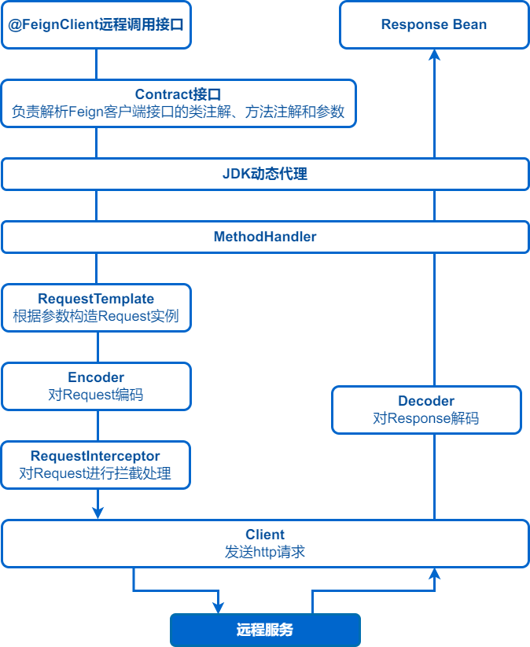
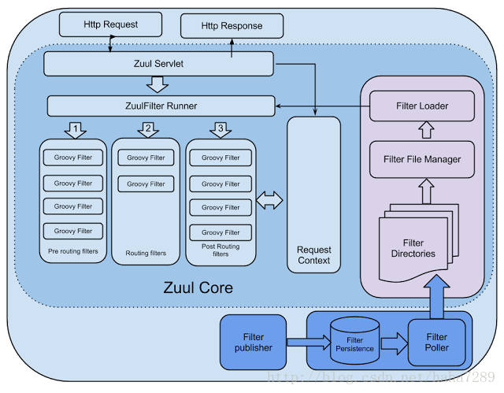
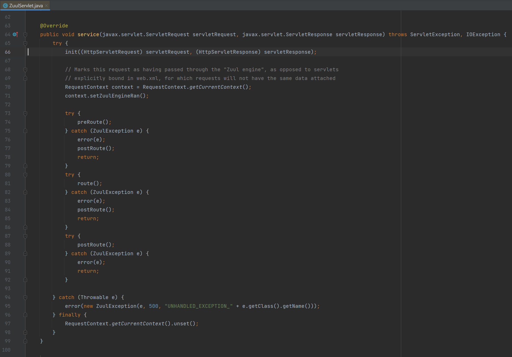
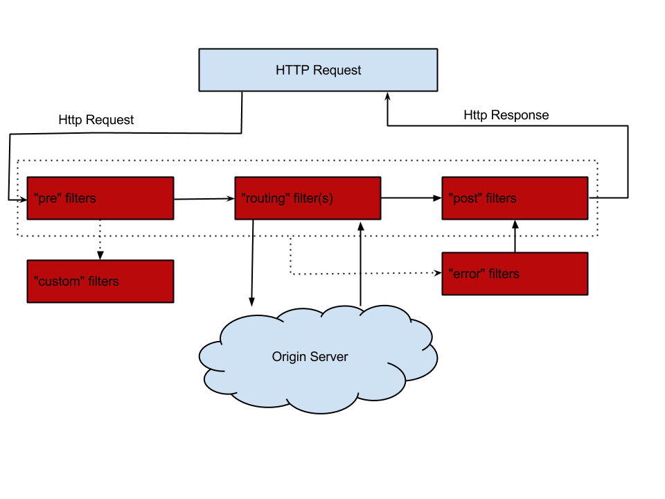

# [前言](#前言)

写作本项目的目的之一是降低阅读原始spring cloud源码的难度。希望掌握本项目讲解的内容之后再阅读原始spring-cloud的源码能起到事半功倍的效果，所以本项目的功能实现逻辑及原理和官方保持一致但追求代码最大精简化，**本项目可以理解为一个源码导读的项目**。

前置知识。阅读spring、springboot、spring cloud三者的源码必须严格按照 spring => springboot => spring cloud 的顺序进行，阅读spring cloud源码的必备前置知识：

- spring，推荐本人写的简化版的spring框架 [**mini-spring**](https://github.com/DerekYRC/mini-spring/blob/main/README_CN.md) 。熟悉spring源码，阅读springboot源码会非常轻松。
- spring boot，重点掌握：1、启动流程 2、**自动装配的原理! 自动装配的原理!! 自动装配的原理!!!** 推荐文章:
  - [《Spring Boot精髓：启动流程源码分析》](https://www.cnblogs.com/java-chen-hao/p/11829344.html)
  - [《SpringBoot自动装配原理，这一篇就够了!》](https://mp.weixin.qq.com/s/f6oED1hbiWat_0HOwxgfnA)
- spring cloud，先学会使用再研究源码，切勿本末倒置。推荐[《精尽Spring Cloud学习指南》](http://svip.iocoder.cn/Spring-Cloud/tutorials/) 。

关于spring cloud。spring cloud是构建通用模式的分布式系统的工具集，通过[**spring-cloud-commons**](https://github.com/spring-cloud/spring-cloud-commons) 定义了统一的抽象API，相当于定义了一套协议标准，具体的实现需要符合这套协议标准。spring cloud官方整合第三方组件Eureka、Ribbon、Hystrix等实现了spring-cloud-netflix，阿里巴巴结合自身的Nacos、Sentinel等实现了spring-cloud-alibaba。本项目基于spring-cloud-commons的协议标准自主开发或整合第三方组件提供具体的实现。

技术能力有限且文采欠佳，大家可以在此[**issue**](https://github.com/DerekYRC/mini-spring-cloud/issues/1) 留言提问题和发表建议，也欢迎Pull Request完善此项目。

# [服务注册](#服务注册)
> 代码分支: service-registry
 
为了演示，写一个非常简单的单机版的服务注册和发现中心，命名图图
```java
@RestController
@SpringBootApplication
public class TutuServerApplication {
    private static Logger logger = LoggerFactory.getLogger(TutuServerApplication.class);

    private ConcurrentHashMap<String, Set<Server>> serverMap = new ConcurrentHashMap<>();

    public static void main(String[] args) {
        SpringApplication.run(TutuServerApplication.class, args);
    }

    /**
     * 服务注册
     *
     * @param serviceName
     * @param ip
     * @param port
     * @return
     */
    @PostMapping("register")
    public boolean register(@RequestParam("serviceName") String serviceName, @RequestParam("ip") String ip, @RequestParam("port") Integer port) {
        logger.info("register service, serviceName: {}, ip: {}, port: {}", serviceName, ip, port);
        serverMap.putIfAbsent(serviceName.toLowerCase(), Collections.synchronizedSet(new HashSet<>()));
        Server server = new Server(ip, port);
        serverMap.get(serviceName).add(server);
        return true;
    }

    /**
     * 服务注销
     *
     * @param serviceName
     * @param ip
     * @param port
     * @return
     */
    @PostMapping("deregister")
    public boolean deregister(@RequestParam("serviceName") String serviceName, @RequestParam("ip") String ip, @RequestParam("port") Integer port) {
        logger.info("deregister service, serviceName: {}, ip: {}, port: {}", serviceName, ip, port);
        Set<Server> serverSet = serverMap.get(serviceName.toLowerCase());
        if (serverSet != null) {
            Server server = new Server(ip, port);
            serverSet.remove(server);
        }
        return true;
    }

    /**
     * 根据服务名称查询服务列表
     *
     * @param serviceName
     * @return
     */
    @GetMapping("list")
    public Set<Server> list(@RequestParam("serviceName") String serviceName) {
        Set<Server> serverSet = serverMap.get(serviceName.toLowerCase());
        logger.info("list service, serviceName: {}, serverSet: {}", serviceName, JSON.toJSONString(serverSet));
        return serverSet != null ? serverSet : Collections.emptySet();
    }

    /**
     * 查询所有服务名称列表
     *
     * @return
     */
    @GetMapping("listServiceNames")
    public Enumeration<String> listServiceNames() {
        return serverMap.keys();
    }

    /**
     * 服务
     */
    public static class Server {
        private String ip;

        private Integer port;
        
        //Construct、Getters、equals、hashCode
    }
}
```
配置application.yml:
```yaml
server:
  port: 6688
```

spring-cloud-commons服务注册相关API:

- ServiceInstance和Registration，表示系统中服务的实例
- ServiceRegistry，服务注册和注销接口
- AbstractAutoServiceRegistration，自动注册和注销服务。监听WebServerInitializedEvent(Web服务启动完毕事件)，WebServerInitializedEvent触发时注册服务实例；@PreDestroy注解修饰的方法注销服务实例。

## 服务注册功能实现

TutuDiscoveryProperties，配置服务注册中心地址:
```java
@ConfigurationProperties("spring.cloud.tutu.discovery")
public class TutuDiscoveryProperties {

    @Autowired
    private InetUtils inetUtils;

    private String serverAddr;

    private String service;

    private String ip;

    private int port = -1;

    private boolean secure = false;

    @PostConstruct
    public void init() throws Exception {
        if (!StringUtils.hasLength(ip)) {
            //获取服务IP地址
            ip = inetUtils.findFirstNonLoopbackHostInfo().getIpAddress();
        }
    }

    //getters and setters
}
```
TutuRegistration，图图服务注册实例:
```java
public class TutuRegistration implements Registration {

    private TutuDiscoveryProperties tutuDiscoveryProperties;

    public TutuRegistration(TutuDiscoveryProperties tutuDiscoveryProperties) {
        this.tutuDiscoveryProperties = tutuDiscoveryProperties;
    }

    @Override
    public boolean isSecure() {
        return tutuDiscoveryProperties.isSecure();
    }

    @Override
    public URI getUri() {
        return DefaultServiceInstance.getUri(this);
    }
  
    //getters and setters
}
```
注册和注销TutuRegistration的接口TutuServiceRegistry:
```java
public class TutuServiceRegistry implements ServiceRegistry<Registration> {
  private static final Logger logger = LoggerFactory.getLogger(TutuServiceRegistry.class);

  private TutuDiscoveryProperties tutuDiscoveryProperties;

  public TutuServiceRegistry(TutuDiscoveryProperties tutuDiscoveryProperties) {
    this.tutuDiscoveryProperties = tutuDiscoveryProperties;
  }

  /**
   * 注册服务实例
   *
   * @param registration
   */
  @Override
  public void register(Registration registration) {
    Map<String, Object> param = new HashMap<>();
    param.put("serviceName", tutuDiscoveryProperties.getService());
    param.put("ip", tutuDiscoveryProperties.getIp());
    param.put("port", tutuDiscoveryProperties.getPort());

    String result = HttpUtil.post(tutuDiscoveryProperties.getServerAddr() + "/register", param);
    if (Boolean.parseBoolean(result)) {
      logger.info("register service successfully, serviceName: {}, ip: {}, port: {}",
              tutuDiscoveryProperties.getService(), tutuDiscoveryProperties.getIp(), tutuDiscoveryProperties.getPort());
    } else {
      logger.error("register service failed, serviceName: {}, ip: {}, port: {}",
              tutuDiscoveryProperties.getService(), tutuDiscoveryProperties.getIp(), tutuDiscoveryProperties.getPort());
      throw new RuntimeException("register service failed, serviceName");
    }
  }

  /**
   * 注销服务实例
   *
   * @param registration
   */
  @Override
  public void deregister(Registration registration) {
    Map<String, Object> param = new HashMap<>();
    param.put("serviceName", tutuDiscoveryProperties.getService());
    param.put("ip", tutuDiscoveryProperties.getIp());
    param.put("port", tutuDiscoveryProperties.getPort());

    String result = HttpUtil.post(tutuDiscoveryProperties.getServerAddr() + "/deregister", param);
    if (Boolean.parseBoolean(result)) {
      logger.info("de-register service successfully, serviceName: {}, ip: {}, port: {}",
              tutuDiscoveryProperties.getService(), tutuDiscoveryProperties.getIp(), tutuDiscoveryProperties.getPort());
    } else {
      logger.warn("de-register service failed, serviceName: {}, ip: {}, port: {}",
              tutuDiscoveryProperties.getService(), tutuDiscoveryProperties.getIp(), tutuDiscoveryProperties.getPort());
    }
  }
}
```
AbstractAutoServiceRegistration实现类:
```java
public class TutuAutoServiceRegistration extends AbstractAutoServiceRegistration<Registration> {

    private TutuRegistration tutuRegistration;

    protected TutuAutoServiceRegistration(ServiceRegistry<Registration> serviceRegistry, TutuRegistration tutuRegistration) {
        super(serviceRegistry, null);
        this.tutuRegistration = tutuRegistration;
    }

    @Override
    protected Registration getRegistration() {
        if (tutuRegistration.getPort() < 0) {
            //设置服务端口
            tutuRegistration.setPort(this.getPort().get());
        }
        return tutuRegistration;
    }
}
```
自动装配:
TutuServiceRegistryAutoConfiguration:
```java
/**
 * 自动配置服务注册相关类
 */
@Configuration
@ConditionalOnProperty(value = "spring.cloud.service-registry.auto-registration.enabled", matchIfMissing = true)
public class TutuServiceRegistryAutoConfiguration {

    @Bean
    @ConditionalOnMissingBean
    public TutuDiscoveryProperties tutuProperties() {
        return new TutuDiscoveryProperties();
    }

    @Bean
    public TutuRegistration tutuRegistration(TutuDiscoveryProperties tutuDiscoveryProperties) {
        return new TutuRegistration(tutuDiscoveryProperties);
    }

    @Bean
    public TutuServiceRegistry tutuServiceRegistry(TutuDiscoveryProperties tutuDiscoveryProperties) {
        return new TutuServiceRegistry(tutuDiscoveryProperties);
    }

    @Bean
    public TutuAutoServiceRegistration tutuAutoServiceRegistration(ServiceRegistry<Registration> serviceRegistry, TutuRegistration tutuRegistration) {
        return new TutuAutoServiceRegistration(serviceRegistry, tutuRegistration);
    }
}
```
META-INF/spring.factories:
```yaml
org.springframework.boot.autoconfigure.EnableAutoConfiguration=\
  com.github.cloud.tutu.registry.TutuServiceRegistryAutoConfiguration
```

## 测试:

1、maven install


2、启动服务注册和发现中心TutuServerApplication

3、启动服务提供者ProviderApplication，其代码如下:
```java
@RestController
@SpringBootApplication
public class ProviderApplication {

    @Value("${server.port}")
    private Integer port;

    public static void main(String[] args) {
        SpringApplication.run(ProviderApplication.class, args);
    }

    @PostMapping("/echo")
    public String echo() {
        return "Port of the service provider: " + port;
    }
}
```
配置application.yml:
```yaml
spring:
  application:
    name: provider-application
  cloud:
    tutu:
      discovery:
        server-addr: localhost:6688
        service: ${spring.application.name}

# 随机端口
server:
  port: ${random.int[10000,20000]}
```

4、浏览器中访问http://localhost:6688/list?serviceName=provider-application 或执行命令 ```curl -X GET 'http://localhost:6688/list?serviceName=provider-application'``` ，响应报文如下，说明服务已经注册到服务注册中心
```json
[
  {
  "ip": "192.168.47.1",
  "port": 19588
  }
]
```

# [服务发现](#服务发现)
> 代码分支: service-discovery

spring-cloud-commons定义的服务发现接口```org.springframework.cloud.client.discovery.DiscoveryClient```:
```java
public interface DiscoveryClient extends Ordered {

	/**
	 * Gets all ServiceInstances associated with a particular serviceId.
	 * @param serviceId The serviceId to query.
	 * @return A List of ServiceInstance.
	 */
	List<ServiceInstance> getInstances(String serviceId);

	/**
	 * @return All known service IDs.
	 */
	List<String> getServices();
}
```

仅需实现DiscoveryClient接口即可，实现类:
```java
/**
 * 服务发现实现类
 */
public class TutuDiscoveryClient implements DiscoveryClient {
    private static final Logger logger = LoggerFactory.getLogger(TutuDiscoveryClient.class);

    private TutuDiscoveryProperties tutuDiscoveryProperties;

    public TutuDiscoveryClient(TutuDiscoveryProperties tutuDiscoveryProperties) {
        this.tutuDiscoveryProperties = tutuDiscoveryProperties;
    }

    @Override
    public List<ServiceInstance> getInstances(String serviceId) {
        Map<String, Object> param = new HashMap<>();
        param.put("serviceName", serviceId);

        String response = HttpUtil.get(tutuDiscoveryProperties.getServerAddr() + "/list", param);
        logger.info("query service instance, serviceId: {}, response: {}", serviceId, response);
        return JSON.parseArray(response).stream().map(hostInfo -> {
            TutuServiceInstance serviceInstance = new TutuServiceInstance();
            serviceInstance.setServiceId(serviceId);
            String ip = ((JSONObject) hostInfo).getString("ip");
            Integer port = ((JSONObject) hostInfo).getInteger("port");
            serviceInstance.setHost(ip);
            serviceInstance.setPort(port);
            return serviceInstance;
        }).collect(Collectors.toList());
    }

    @Override
    public List<String> getServices() {
        String response = HttpUtil.post(tutuDiscoveryProperties.getServerAddr() + "/listServiceNames", new HashMap<>());
        logger.info("query service instance list, response: {}", response);
        return JSON.parseArray(response, String.class);
    }
}
```

自动装配TutuDiscoveryAutoConfiguration:
```java
@Configuration
public class TutuDiscoveryAutoConfiguration {

    @Bean
    @ConditionalOnMissingBean
    public TutuDiscoveryProperties tutuDiscoveryProperties() {
        return new TutuDiscoveryProperties();
    }

    @Bean
    public DiscoveryClient tutuDiscoveryClient(TutuDiscoveryProperties tutuDiscoveryProperties) {
        return new TutuDiscoveryClient(tutuDiscoveryProperties);
    }
}
```
spring.factories:
```yaml
org.springframework.boot.autoconfigure.EnableAutoConfiguration=\
  com.github.cloud.tutu.registry.TutuServiceRegistryAutoConfiguration,\
  com.github.cloud.tutu.discovery.TutuDiscoveryAutoConfiguration
```

## 测试:

1、maven install，启动服务注册和发现中心TutuServerApplication，启动服务提供者ProviderApplication，启动服务消费者ConsumerApplication(后续测试步骤均同此，不再提及)

服务消费者代码如下:
```java
@SpringBootApplication
public class ConsumerApplication {

  public static void main(String[] args) {
    SpringApplication.run(ConsumerApplication.class, args);
  }

  @RestController
  static class HelloController {

    @Autowired
    private DiscoveryClient discoveryClient;

    private RestTemplate restTemplate = new RestTemplate();

    @GetMapping("/hello")
    public String hello() {
      List<ServiceInstance> serviceInstances = discoveryClient.getInstances("provider-application");
      if (serviceInstances.size() > 0) {
        ServiceInstance serviceInstance = serviceInstances.get(0);
        URI uri = serviceInstance.getUri();
        String response = restTemplate.postForObject(uri.toString() + "/echo", null, String.class);
        return response;
      }

      throw new RuntimeException("No service instance for provider-application found");
    }
  }
}
```
application.yml:
```yaml
spring:
  application:
    name: consumer-application
  cloud:
    tutu:
      discovery:
        server-addr: localhost:6688
        service: ${spring.application.name}
```

2、访问http://localhost:8080/hello ,相应报文如下:
```yaml
Port of the service provider: 19922
```

# [集成ribbon实现客户端负载均衡](#集成ribbon实现客户端负载均衡)
> 代码分支: load-balancer

## 关于ribbon

(翻译自官方文档)ribbon是一个提供如下功能的依赖包:
- 负载均衡
- 容错机制
- 支持多种协议(HTTP, TCP, UDP)，支持异步和响应式的调用方式
- 缓存和批处理

#### ribbon核心API

一、IClientConfig接口


定义加载和读取ribbon客户端配置的方法，实现类DefaultClientConfigImpl

二、IPing接口


顾名思义，判断服务是否存活，实现类:

- NoOpPing，不做检查，认为服务存活
- DummyPing，不做检查，认为服务存活

三、ServerList接口


获取服务实例列表的接口，实现类:

- ConfigurationBasedServerList，基于配置获取服务实例列表

四、IRule接口


负载均衡规则，实现类:

- RoundRobinRule，轮询
- RandomRule，随机
- WeightedResponseTimeRule，根据响应时间分配权重，响应时间越短权重越大
- BestAvailableRule，跳过被熔断器标记为"tripped"状态的、并且选择并发请求数最小的服务实例
- ZoneAvoidanceRule，根据所属zone和可用性筛选服务实例，在没有多zone的情况下退化为轮询RoundRobinRule
- AvailabilityFilteringRule，过滤掉一直连接失败或活跃连接数超过配置值的服务实例
- RetryRule，对其他负载均衡规则的包装，在一段时间内失败重试

五、ServerListFilter接口


服务实例过滤器

六、ServerListUpdater接口


PollingServerListUpdater，起一个周期任务更新服务实例列表

七、ILoadBalancer接口


负载均衡接口，实现类：

- BaseLoadBalancer，手动设置服务实例，根据负载均衡规则IRule筛选服务实例
- DynamicServerListLoadBalancer，使用ServerListUpdater动态更新服务实例列表
- ZoneAwareLoadBalancer，支持zone

## 集成ribbon实现客户端负载均衡(一)

spring-cloud-commons负载均衡相关API:

- ServiceInstanceChooser接口，服务实例选择器，根据服务提供者的服务名称选择服务实例

```java
/**
 * Implemented by classes which use a load balancer to choose a server to send a request to.
 */
public interface ServiceInstanceChooser {

	/**
	 * Chooses a ServiceInstance from the LoadBalancer for the specified service.
	 */
	ServiceInstance choose(String serviceId);

	/**
	 * Chooses a ServiceInstance from the LoadBalancer for the specified service and LoadBalancer request.
	 */
	<T> ServiceInstance choose(String serviceId, Request<T> request);
}
```

- LoadBalancerClient接口

```java
/**
 * Represents a client-side load balancer.
 */
public interface LoadBalancerClient extends ServiceInstanceChooser {

	/**
	 * Executes request using a ServiceInstance from the LoadBalancer for the specified service.
	 */
	<T> T execute(String serviceId, LoadBalancerRequest<T> request) throws IOException;

	/**
	 * Executes request using a ServiceInstance from the LoadBalancer for the specified service.
	 */
	<T> T execute(String serviceId, ServiceInstance serviceInstance, LoadBalancerRequest<T> request) throws IOException;

	/**
	 * Creates a proper URI with a real host and port for systems to utilize. Some systems
	 * use a URI with the logical service name as the host, such as
	 * http://myservice/path/to/service. This will replace the service name with the
	 * host:port from the ServiceInstance.
	 */
	URI reconstructURI(ServiceInstance instance, URI original);
}
```

本节只关注ServiceInstanceChooser接口的choose方法，下一节讲解LoadBalancerClient接口的三个方法。

负载均衡功能实现:

RibbonClientConfiguration，配置ribbon核心API默认实现类:

```java
/**
 * 配置ribbon默认组件
 */
@Configuration
public class RibbonClientConfiguration {

    @Value("${ribbon.client.name}")
    private String name;

    @Bean
    @ConditionalOnMissingBean
    public IClientConfig ribbonClientConfig() {
        DefaultClientConfigImpl config = new DefaultClientConfigImpl();
        config.loadProperties(name);
        return config;
    }

    @Bean
    @ConditionalOnMissingBean
    public IRule ribbonRule(IClientConfig config) {
        ZoneAvoidanceRule rule = new ZoneAvoidanceRule();
        rule.initWithNiwsConfig(config);
        return rule;
    }

    @Bean
    @ConditionalOnMissingBean
    public IPing ribbonPing(IClientConfig config) {
        return new DummyPing();
    }

    @Bean
    @ConditionalOnMissingBean
    public ServerList<Server> ribbonServerList(IClientConfig config) {
        ConfigurationBasedServerList serverList = new ConfigurationBasedServerList();
        serverList.initWithNiwsConfig(config);
        return serverList;
    }

    @Bean
    @ConditionalOnMissingBean
    public ServerListUpdater ribbonServerListUpdater(IClientConfig config) {
        return new PollingServerListUpdater(config);
    }

    @Bean
    @ConditionalOnMissingBean
    public ServerListFilter<Server> ribbonServerListFilter(IClientConfig config) {
        ServerListSubsetFilter filter = new ServerListSubsetFilter();
        filter.initWithNiwsConfig(config);
        return filter;
    }

    @Bean
    @ConditionalOnMissingBean
    public ILoadBalancer ribbonLoadBalancer(IClientConfig config,
                                            ServerList<Server> serverList, ServerListFilter<Server> serverListFilter,
                                            IRule rule, IPing ping, ServerListUpdater serverListUpdater) {
        return new ZoneAwareLoadBalancer<>(config, rule, ping, serverList,
                serverListFilter, serverListUpdater);
    }
}
```

只需实现ribbon核心API中的获取服务实例列表接口ServerList，实现类TutuServerList:

```java
/**
 * 查询图图服务实例列表
 */
public class TutuServerList extends AbstractServerList<TutuServer> {
    private static Logger logger = LoggerFactory.getLogger(TutuServerList.class);

    private TutuDiscoveryProperties discoveryProperties;

    private String serviceId;

    public TutuServerList(TutuDiscoveryProperties discoveryProperties) {
        this.discoveryProperties = discoveryProperties;
    }

    /**
     * 查询服务实例列表
     *
     * @return
     */
    @Override
    public List<TutuServer> getInitialListOfServers() {
        return getServer();
    }

    /**
     * 查询服务实例列表
     *
     * @return
     */
    @Override
    public List<TutuServer> getUpdatedListOfServers() {
        return getServer();
    }

    private List<TutuServer> getServer() {
        Map<String, Object> param = new HashMap<>();
        param.put("serviceName", serviceId);

        String response = HttpUtil.get(discoveryProperties.getServerAddr() + "/list", param);
        logger.info("query service instance, serviceId: {}, response: {}", serviceId, response);
        return JSON.parseArray(response).stream().map(hostInfo -> {
            String ip = ((JSONObject) hostInfo).getString("ip");
            Integer port = ((JSONObject) hostInfo).getInteger("port");
            return new TutuServer(ip, port);
        }).collect(Collectors.toList());
    }

    public String getServiceId() {
        return serviceId;
    }

    @Override
    public void initWithNiwsConfig(IClientConfig iClientConfig) {
        this.serviceId = iClientConfig.getClientName();
    }
}
```

配置TutuServerList，替换RibbonClientConfiguration中配置的默认实现:

```java
@Configuration
@RibbonClients(defaultConfiguration = TutuRibbonClientConfiguration.class)
public class RibbonTutuAutoConfiguration {
}
```

```java
/**
 * 自定义ribbon组件
 */
@Configuration
public class TutuRibbonClientConfiguration {

    @Bean
    @ConditionalOnMissingBean
    public ServerList<?> ribbonServerList(IClientConfig config,
                                          TutuDiscoveryProperties discoveryProperties) {
        TutuServerList serverList = new TutuServerList(discoveryProperties);
        serverList.initWithNiwsConfig(config);
        return serverList;
    }
}
```

每一个Provider服务集群（应用名称即spring.application.name相同的所有应用服务提供者）对应一套ribbon核心API。**SpringClientFactory继承自NamedContextFactory，为每一套ribbon核心API创建一个子spring应用上下文（ApplicationContext）**，来隔离不同服务的ribbon核心API配置，可以定制化不同服务的负载均衡规则（扩展篇实现）。

SpringClientFactory的构造函数参数**RibbonClientConfiguration**配置ribbon默认的核心API。

修饰RibbonTutuAutoConfiguration配置类的注解RibbonClients引入了**自动配置类RibbonClientConfigurationRegistrar**，将RibbonClients注解指定的defaultConfiguration属性的值即TutuRibbonClientConfiguration配置类**包装为RibbonClientSpecification**。**RibbonClientSpecification作为SpringClientFactory的属性，用来覆盖RibbonClientConfiguration配置类指定的默认的核心API**，比如TutuRibbonClientConfiguration配置类使用TutuServerList替换RibbonClientConfiguration配置类中指定的ConfigurationBasedServerList。

可能表述得不清楚，为了充分理解子spring容器的创建逻辑，可以在下面的测试环节debug如下几个方法:

- RibbonClientConfigurationRegistrar#registerBeanDefinitions
- RibbonAutoConfiguration#springClientFactory
- SpringClientFactory的构造函数和方法

LoadBalancerClient实现类RibbonLoadBalancerClient:

```java
/**
 * ribbon负载均衡客户端
 */
public class RibbonLoadBalancerClient implements LoadBalancerClient {

    private SpringClientFactory clientFactory;

    public RibbonLoadBalancerClient(SpringClientFactory clientFactory) {
        this.clientFactory = clientFactory;
    }

    /**
     * 选择服务实例
     */
    @Override
    public ServiceInstance choose(String serviceId) {
        return choose(serviceId, null);
    }

    /**
     * 选择服务实例
     */
    @Override
    public <T> ServiceInstance choose(String serviceId, Request<T> request) {
        ILoadBalancer loadBalancer = clientFactory.getInstance(serviceId, ILoadBalancer.class);
        Server server = loadBalancer.chooseServer("default");
        if (server != null) {
            return new TutuServiceInstance(serviceId, server.getHost(), server.getPort());
        }

        return null;
    }
}
```

自动装配spring.factories

```yaml
org.springframework.boot.autoconfigure.EnableAutoConfiguration=\
  com.github.cloud.loadbalancer.ribbon.config.RibbonAutoConfiguration,\
  com.github.cloud.loadbalancer.ribbon.config.RibbonTutuAutoConfiguration
```

## 测试:

1、在mini-spring-cloud-provider-example文件夹下执行命令```mvn spring-boot:run```启动多个服务提供者

服务消费者代码:

```java
@SpringBootApplication
public class ConsumerApplication {

    public static void main(String[] args) {
        SpringApplication.run(ConsumerApplication.class, args);
    }
    
    @RestController
    static class HelloController {

      private RestTemplate restTemplate = new RestTemplate();

        @GetMapping("/world")
        public String world() {
            ServiceInstance serviceInstance = loadBalancerClient.choose("provider-application");
            if (serviceInstance != null) {
                URI uri = serviceInstance.getUri();
                String response = restTemplate.postForObject(uri.toString() + "/echo", null, String.class);
                return response;
            }

            throw new RuntimeException("No service instance for provider-application found");
        }
    }
}
```

2、多次访问```http://localhost:8080/world```, 通过响应报文中的端口可知请求以轮询的方式分配给服务提供者(默认的负载均衡规则ZoneAvoidanceRule在没有多zone的情况下退化为轮询规则)

## 集成ribbon实现客户端负载均衡(二)

简化调用方式，达到如下的效果，使用服务提供者的名称替换IP和端口

```java
restTemplate.postForObject("http://provider-application/echo", null, String.class);
```

实现LoadBalancerClient的execute方法和reconstructURI方法:

```java
public class RibbonLoadBalancerClient implements LoadBalancerClient {

    /**
     * 重建请求URI，将服务名称替换为服务实例的IP:端口
     */
    @Override
    public URI reconstructURI(ServiceInstance server, URI original) {
        try {
            //将服务名称替换为服务实例的IP:端口，例如http://provider-application/echo被重建为http://192.168.100.1:8888/echo
            StringBuilder sb = new StringBuilder();
            sb.append(original.getScheme()).append("://");
            sb.append(server.getHost());
            sb.append(":").append(server.getPort());
            sb.append(original.getRawPath());
            if (StrUtil.isNotEmpty(original.getRawQuery())) {
                sb.append("?").append(original.getRawQuery());
            }
            URI newURI = new URI(sb.toString());
            return newURI;
        } catch (URISyntaxException e) {
            throw new RuntimeException(e);
        }
    }

    /**
     * 处理http请求
     */
    @Override
    public <T> T execute(String serviceId, LoadBalancerRequest<T> request) throws IOException {
        ServiceInstance serviceInstance = choose(serviceId);
        return execute(serviceId, serviceInstance, request);
    }

    /**
     * 处理http请求
     *
     */
    @Override
    public <T> T execute(String serviceId, ServiceInstance serviceInstance, LoadBalancerRequest<T> request) throws IOException {
        try {
            return request.apply(serviceInstance);
        } catch (Exception ex) {
            throw new RuntimeException(ex);
        }
    }
}
```

- reconstructURI方法，重建请求URI，将服务名称替换为服务实例的IP:端口，例如```http://provider-application/echo``` 被重建为```http://192.168.100.1:8888/echo```
- execute方法，处理http请求

有了RibbonLoadBalancerClient的reconstructURI和execute方法，将所有http请求委托给RibbonLoadBalancerClient即可。其实spring-cloud-commons已经帮我们配置好拦截RestTemplate的http请求委托给RibbonLoadBalancerClient的拦截器LoadBalancerInterceptor，配置类（有删减）如下:


LoadBalancerAutoConfiguration配置类**为每一个被LoadBalanced注解修饰的RestTemplate增加LoadBalancerInterceptor拦截器。**


LoadBalancerInterceptor将http请求委托给LoadBalancerClient执行，其中requestFactory.createRequest使用ServiceRequestWrapper包装原始的http请求


ServiceRequestWrapper调用LoadBalancerClient#reconstructURI方法重建请求URI，将服务名称替换为服务实例的IP:端口

## 测试:

服务消费者代码如下:

```java
@SpringBootApplication
public class ConsumerApplication {

    public static void main(String[] args) {
        SpringApplication.run(ConsumerApplication.class, args);
    }

    @Configuration
    static class RestTemplateConfiguration {

        /**
         * 赋予负载均衡的能力
         *
         * @return
         */
        @LoadBalanced
        @Bean
        public RestTemplate restTemplate() {
            return new RestTemplate();
        }
    }

    @RestController
    static class HelloController {

        @Autowired
        private RestTemplate loadBalancedRestTemplate;

        @GetMapping("/foo")
        public String foo() {
            return loadBalancedRestTemplate.postForObject("http://provider-application/echo", null, String.class);
        }
    }
}
```

访问```http://localhost:8080/foo```

# [集成Feign简化调用方式](#集成Feign简化调用方式)
> 代码分支: open-feign

## 关于feign
[Open Feign](https://github.com/OpenFeign/feign) 是一个简化http调用方式的Java客户端。使用示例:

```java
interface HelloService {

  @RequestLine("GET /hello")
  String hello();
}

@Test
public void testOpenFeign() {
  HelloService helloService = Feign.builder()
          .target(HelloService.class, "http://localhost:8080");
  String response = helloService.hello();
}
```

Spring Cloud基于Open Feign开发了[Spring Cloud OpenFeign](https://github.com/spring-cloud/spring-cloud-openfeign) ，得以支持Spring Mvc的注解（通过实现了feign的Contract接口的实现类SpringMvcContract），使用示例:

```java
interface WorldService {

    @GetMapping("/world")
    String world();
}

@Test
public void testSpringCloudOpenFeign() {
    WorldService worldService = Feign.builder()
            .contract(new SpringMvcContract())
            .target(WorldService.class, "http://localhost:8080");
    String response = worldService.world();
}
```

可以dubug上面两个示例，代码放在测试类FeignTest中，重点关注Contract接口对注解的解析

#### Open Feign工作流程



#### Open Feign核心API

一、Contract接口

负责解析Feign客户端接口的类注解、方法注解和参数。

实现类```feign.Contract.Default```支持Open Feign的注解，比如上面第一个示例中的RequestLine注解。

Spring Cloud OpenFeign开发的实现类```SpringMvcContract```支持Spring MVC的注解，如GetMapping、PostMapping、RequestMapping。

二、Encoder接口

编码器，将请求对象编码为请求体

三、Decoder接口

解码器，将响应体解码为对象

四、RequestInterceptor拦截器接口

对请求进行拦截处理

五、Client接口

提交http请求的接口

## 功能实现

**@EnableFeignClients注解**开启集成Feign客户端，该注解Import配置类FeignClientsRegistrar:

```java
/**
 * 启用Feign
 */
@Retention(RetentionPolicy.RUNTIME)
@Target(ElementType.TYPE)
@Documented
@Import(FeignClientsRegistrar.class)
public @interface EnableFeignClients {
}
```

配置类FeignClientsRegistrar扫描每个被FeignClient注解修饰的接口，基于JDK动态代理生成对象，注册到bean容器:

```java
/**
 * 往bean容器中注册Feign客户端
 */
public class FeignClientsRegistrar implements ImportBeanDefinitionRegistrar {

    /**
     * 往bean容器中注册Feign客户端
     */
    @Override
    public void registerBeanDefinitions(AnnotationMetadata importingClassMetadata, BeanDefinitionRegistry registry) {
        //为FeignClient注解修饰的接口生成代理bean即Feign客户端，并注册到bean容器
        String packageName = ClassUtils.getPackageName(importingClassMetadata.getClassName());
        //扫描所有被FeignClient注解修饰的接口
        Set<Class<?>> classes = ClassUtil.scanPackageByAnnotation(packageName, FeignClient.class);
        for (Class<?> clazz : classes) {
            GenericBeanDefinition beanDefinition = new GenericBeanDefinition();
            //使用FeignClientFactoryBean生成Feign客户端
            beanDefinition.setBeanClass(FeignClientFactoryBean.class);
            String clientName = clazz.getAnnotation(FeignClient.class).value();
            beanDefinition.getPropertyValues().addPropertyValue("contextId", clientName);
            beanDefinition.getPropertyValues().addPropertyValue("type", clazz);

            //将Feign客户端注册进bean容器
            String beanName = clazz.getName();
            registry.registerBeanDefinition(beanName, beanDefinition);
        }
    }
}
```

注意BeanDefinition指定的beanClass为FeignClientFactoryBean，它是FactoryBean的实现类，bean容器取其getObject方法返回值作为bean:

```java
/**
 * 生成Feign客户端的FactoryBean
 */
public class FeignClientFactoryBean implements FactoryBean<Object>, ApplicationContextAware {

    private String contextId;

    private Class<?> type;

    private ApplicationContext applicationContext;

    @Override
    public Object getObject() throws Exception {
        FeignContext feignContext = applicationContext.getBean(FeignContext.class);
        Encoder encoder = feignContext.getInstance(contextId, Encoder.class);
        Decoder decoder = feignContext.getInstance(contextId, Decoder.class);
        Contract contract = feignContext.getInstance(contextId, Contract.class);
        Client client = feignContext.getInstance(contextId, Client.class);

        return Feign.builder()
                .encoder(encoder)
                .decoder(decoder)
                .contract(contract)
                .client(client)
                .target(new HardCodedTarget<>(type, contextId, "http://" + contextId));
    }

    //other methods
}
```

跟ribbon一样，每一个Provider服务集群（应用名称即spring.application.name相同的所有应用服务提供者）对应一套feign核心API。**FeignContext继承自NamedContextFactory，为每一套feign核心API创建一个子spring应用上下文（ApplicationContext）**，来隔离不同服务的feign核心API配置(扩展篇实现)。

FeignContext:

```java
/**
 * 为每个feign客户端创建一个应用上下文(ApplicationContext)，隔离每个feign客户端的配置
 */
public class FeignContext extends NamedContextFactory<FeignClientSpecification> {

    public FeignContext() {
        super(FeignClientsConfiguration.class, "feign", "feign.client.name");
    }
}
```

FeignClientsConfiguration配置类配置feign的核心API

```java
/**
 * 配置feign的核心API
 */
@Configuration
public class FeignClientsConfiguration {

    @Bean
    @ConditionalOnMissingBean
    public Encoder encoder() {
        return new Encoder.Default();
    }

    @Bean
    @ConditionalOnMissingBean
    public Decoder decoder() {
        return new Decoder.Default();
    }

    @Bean
    @ConditionalOnMissingBean
    public Contract contract() {
        return new SpringMvcContract();
    }

    @Bean
    @ConditionalOnMissingBean
    public Client client(LoadBalancerClient loadBalancerClient) {
        return new LoadBalancerFeignClient(loadBalancerClient, new Client.Default(null, null));
    }
}
```

SpringMvcContract简单实现支持Spring MVC的PostMapping注解:

```java
/**
 * feign支持Spring MVC的注解
 */
public class SpringMvcContract extends Contract.BaseContract {

    @Override
    protected void processAnnotationOnClass(MethodMetadata data, Class<?> clz) {
        //TODO 解析接口注解
    }

    @Override
    protected void processAnnotationOnMethod(MethodMetadata data, Annotation annotation, Method method) {
        //解析方法注解
        //解析PostMapping注解
        if (annotation instanceof PostMapping) {
            PostMapping postMapping = (PostMapping) annotation;
            data.template().method(Request.HttpMethod.POST);
            String path = postMapping.value()[0];
            if (!path.startsWith("/") && !data.template().path().endsWith("/")) {
                path = "/" + path;
            }
            data.template().uri(path, true);
        }

        //TODO 解析其他注解
    }

    @Override
    protected boolean processAnnotationsOnParameter(MethodMetadata data, Annotation[] annotations, int paramIndex) {
        //TODO 解析参数
        return true;
    }
}
```

LoadBalancerFeignClient组合ribbon的客户端负载均衡能力选择服务示例，然后发送http请求:

```java
/**
 * 具备负载均衡能力的feign client
 */
public class LoadBalancerFeignClient implements Client {

    private LoadBalancerClient loadBalancerClient;

    private Client delegate;

    public LoadBalancerFeignClient(LoadBalancerClient loadBalancerClient, Client delegate) {
        this.loadBalancerClient = loadBalancerClient;
        this.delegate = delegate;
    }

    @SuppressWarnings("deprecation")
    @Override
    public Response execute(Request request, Request.Options options) throws IOException {
        try {
            //客户端负载均衡
            URI original = URI.create(request.url());
            String serviceId = original.getHost();
            //选择服务实例
            ServiceInstance serviceInstance = loadBalancerClient.choose(serviceId);
            //重建请求URI
            URI uri = loadBalancerClient.reconstructURI(serviceInstance, original);

            Request newRequest = Request.create(request.httpMethod(), uri.toASCIIString(), new HashMap<>(),
                    request.body(), StandardCharsets.UTF_8);
            return delegate.execute(newRequest, options);
        } catch (IOException e) {
            throw new RuntimeException(e);
        }
    }
}
```

自动装配:

```java
@Configuration
public class FeignAutoConfiguration {

    @Bean
    public FeignContext feignContext() {
        return new FeignContext();
    }
}
```

spring.factories:

```yaml
org.springframework.boot.autoconfigure.EnableAutoConfiguration=\
  com.github.cloud.openfeign.FeignAutoConfiguration
```

## 测试:

消费者代码，使用@EnableFeignClients注解启用Feign:

```java
@EnableFeignClients
@SpringBootApplication
public class ConsumerApplication {

    public static void main(String[] args) {
        SpringApplication.run(ConsumerApplication.class, args);
    }

    @RestController
    static class HelloController {

        @Autowired
        private EchoService echoService;

        @GetMapping("/bar")
        public String bar() {
            return echoService.echo();
        }
    }
}
```

Feign客户端:

```java
@FeignClient("provider-application")
public interface EchoService {

    @PostMapping("echo")
    String echo();
}
```

访问```http://localhost:8080/bar```

# [API网关](#API网关)
> 代码分支: api-gateway-netflix-zuul

## 关于Netflix Zuul

Netflix Zuul是一个提供动态路由、监控、弹性容量、安全等功能的基于第七层网络协议的应用程序网关。

#### Zuul核心框架和执行流程



**ZuulServlet负责拦截http请求，然后将http请求交给由ZuulFilter组成的过滤器链处理，ZuulFilter加载模块负责加载ZuulFilter。**

**可见ZuulFilter过滤器是zuul框架中的核心**，API网关的鉴权、限流、权限、熔断、协议转换、错误码统一、缓存、日志、监控、告警等等功能可以实现ZuulFilter过滤器来实现。

#### ZuulFilter过滤器类型及执行顺序

ZuulFilter过滤器分为四种类型：

- pre类型：调用远程服务之前执行
- route：路由、发起远程调用
- post：向客户端输出响应报文
- error：处理过滤器链执行过程中出现的错误

ZuulServlet.service方法:



从ZuulServlet.service方法中能看出四种类型的过滤器的执行顺序如下图所示：



## 功能实现

EnableZuulProxy注解启用API网关功能

```java
@Target(ElementType.TYPE)
@Retention(RetentionPolicy.RUNTIME)
@Import(ZuulServerAutoConfiguration.class)
public @interface EnableZuulProxy {
}
```

EnableZuulProxy注解引入配置类ZuulServerAutoConfiguration，该配置类配置了ZuulServlet、过滤器加载模块的FilterRegistry、实现的三个ZuulFilter以及PreDecorationFilter过滤器需要使用的路由定位器RouteLocator。

```java

@Configuration
@EnableConfigurationProperties({ZuulProperties.class})
public class ZuulServerAutoConfiguration {

  @Autowired
  protected ZuulProperties zuulProperties;

  /**
   * 注册ZuulServlet，用于拦截处理http请求
   */
  @Bean
  public ServletRegistrationBean zuulServlet() {
    return new ServletRegistrationBean<>(new ZuulServlet(), zuulProperties.getServletPath());
  }

  /**
   * 路由定位器
   */
  @Bean
  public RouteLocator simpleRouteLocator() {
    return new SimpleRouteLocator(zuulProperties);
  }

  /**
   * pre类型过滤器，根据RouteLocator来进行路由规则的匹配
   */
  @Bean
  public ZuulFilter preDecorationFilter(RouteLocator routeLocator) {
    return new PreDecorationFilter(routeLocator);
  }

  /**
   * route类型过滤器，使用ribbon负载均衡器进行http请求
   */
  @Bean
  ZuulFilter ribbonRoutingFilter(LoadBalancerClient loadBalancerClient) {
    return new RibbonRoutingFilter(loadBalancerClient);
  }

  /**
   * post类型过滤器，向客户端输出响应报文
   */
  @Bean
  ZuulFilter sendResponseFilter() {
    return new SendResponseFilter();
  }

  /**
   * 注册过滤器
   */
  @Bean
  public FilterRegistry filterRegistry(Map<String, ZuulFilter> filterMap) {
    FilterRegistry filterRegistry = FilterRegistry.instance();
    filterMap.forEach((name, filter) -> {
      filterRegistry.put(name, filter);
    });
    return filterRegistry;
  }
}
```

只针对正常流程实现了以下三个过滤器，想了解更多过滤器可以参考这篇文章: [**Spring Cloud 源码分析（四）Zuul：核心过滤器**](https://blog.didispace.com/spring-cloud-source-zuul/)

- **pre类型过滤器PreDecorationFilter**，使用路由定位器RouteLocator根据请求路径匹配路由，将路由信息放进请求上下文RequestContext中

```java
/**
 * pre类型过滤器，根据RouteLocator来进行路由规则的匹配
 */
public class PreDecorationFilter extends ZuulFilter {
  private static Logger logger = LoggerFactory.getLogger(PreDecorationFilter.class);

  private RouteLocator routeLocator;

  public PreDecorationFilter(RouteLocator routeLocator) {
    this.routeLocator = routeLocator;
  }

  @Override
  public String filterType() {
    return PRE_TYPE;
  }

  @Override
  public int filterOrder() {
    return 5;
  }

  @Override
  public boolean shouldFilter() {
    return true;
  }

  @Override
  public Object run() throws ZuulException {
    RequestContext requestContext = RequestContext.getCurrentContext();
    String requestURI = requestContext.getRequest().getRequestURI();
    //获取匹配的路由
    Route route = routeLocator.getMatchingRoute(requestURI);
    if (route != null) {
      requestContext.put(REQUEST_URI_KEY, route.getPath());
      requestContext.set(SERVICE_ID_KEY, route.getLocation());
    } else {
      logger.error("获取不到匹配的路由, requestURI: {}", requestContext);
    }

    return null;
  }
}
```

路由定位器:

```java
/**
 * 路由定位器
 */
public interface RouteLocator {

  /**
   * 获取匹配的路由
   *
   * @param path
   * @return
   */
  Route getMatchingRoute(String path);
}
```

```java
/**
 * 路由定位器实现类
 */
public class SimpleRouteLocator implements RouteLocator {

  private ZuulProperties zuulProperties;

  private PathMatcher pathMatcher = new AntPathMatcher();

  public SimpleRouteLocator(ZuulProperties zuulProperties) {
    this.zuulProperties = zuulProperties;
  }

  @Override
  public Route getMatchingRoute(String path) {
    for (Map.Entry<String, ZuulProperties.ZuulRoute> entry : zuulProperties.getRoutes().entrySet()) {
      ZuulProperties.ZuulRoute zuulRoute = entry.getValue();
      String pattern = zuulRoute.getPath();
      if (pathMatcher.match(pattern, path)) {
        String targetPath = path.substring(pattern.indexOf("*") - 1);
        return new Route(targetPath, zuulRoute.getServiceId());
      }
    }

    return null;
  }
}
```

- **route类型过滤器RibbonRoutingFilter**，根据PreDecorationFilter过滤器匹配的路由信息发起远程调用，将调用结果放进请求上下文RequestContext

```java
/**
 * route类型过滤器，使用ribbon负载均衡器进行http请求
 */
public class RibbonRoutingFilter extends ZuulFilter {
  private static Logger logger = LoggerFactory.getLogger(RibbonRoutingFilter.class);

  private LoadBalancerClient loadBalancerClient;

  public RibbonRoutingFilter(LoadBalancerClient loadBalancerClient) {
    this.loadBalancerClient = loadBalancerClient;
  }

  @Override
  public String filterType() {
    return ROUTE_TYPE;
  }

  @Override
  public int filterOrder() {
    return 10;
  }

  @Override
  public boolean shouldFilter() {
    RequestContext requestContext = RequestContext.getCurrentContext();
    return requestContext.get(SERVICE_ID_KEY) != null;
  }

  @Override
  public Object run() throws ZuulException {
    try {
      RequestContext requestContext = RequestContext.getCurrentContext();
      //使用ribbon的负载均衡能力发起远程调用
      //TODO 简单实现，熔断降级章节再完善
      String serviceId = (String) requestContext.get(SERVICE_ID_KEY);
      ServiceInstance serviceInstance = loadBalancerClient.choose(serviceId);
      if (serviceInstance == null) {
        logger.error("根据serviceId查询不到服务示例，serviceId: {}", serviceId);
        return null;
      }

      String requestURI = (String) requestContext.get(REQUEST_URI_KEY);
      String url = serviceInstance.getUri().toString() + requestURI;
      HttpRequest httpRequest = HttpUtil.createRequest(Method.POST, url);
      HttpResponse httpResponse = httpRequest.execute();

      //将响应报文的状态码和内容写进请求上下文中
      requestContext.setResponseStatusCode(httpResponse.getStatus());
      requestContext.setResponseDataStream(httpResponse.bodyStream());

      return httpResponse;
    } catch (Exception e) {
      rethrowRuntimeException(e);
    }
    return null;
  }
}
```

- **post类型过滤器SendResponseFilter**，将RibbonRoutingFilter过滤器发起远程调用的结果作为响应报文输出给客户端

```java
/**
 * post类型过滤器，向客户端输出响应报文
 */
public class SendResponseFilter extends ZuulFilter {
  private static Logger logger = LoggerFactory.getLogger(SendResponseFilter.class);

  @Override
  public String filterType() {
    return POST_TYPE;
  }

  @Override
  public int filterOrder() {
    return 1000;
  }

  @Override
  public boolean shouldFilter() {
    return RequestContext.getCurrentContext()
            .getResponseDataStream() != null;
  }

  @Override
  public Object run() throws ZuulException {
    //向客户端输出响应报文
    RequestContext requestContext = RequestContext.getCurrentContext();
    InputStream inputStream = requestContext.getResponseDataStream();
    try {
      HttpServletResponse servletResponse = requestContext.getResponse();
      servletResponse.setCharacterEncoding("UTF-8");

      OutputStream outStream = servletResponse.getOutputStream();
      StreamUtils.copy(inputStream, outStream);
    } catch (Exception e) {
      rethrowRuntimeException(e);
    } finally {
      //关闭输入输出流
      if (inputStream != null) {
        try {
          inputStream.close();
        } catch (Exception e) {
          logger.error("关闭输入流失败", e);
        }
      }

      //Servlet容器会自动关闭输出流
    }
    return null;
  }
}
```

## 测试:

启动API网关ApiGatewayApplication

API网关代码:

```java

@EnableZuulProxy
@SpringBootApplication
public class ApiGatewayApplication {

  public static void main(String[] args) {
    SpringApplication.run(ApiGatewayApplication.class, args);
  }
}
```

配置application.yml:
```yaml
spring:
  application:
    name: api-gateway-application
  cloud:
    tutu:
      discovery:
        server-addr: localhost:6688
        service: ${spring.application.name}

server:
  port: 8888

zuul:
  servlet-path: /*
  routes:
    route_provider_application:
      path: /provider-application/**
      service-id: provider-application
```

访问```http://localhost:8888/provider-application/echo```

# [流量控制和熔断降级](#流量控制和熔断降级)

TODO 待研究完Sentinel再写本章节，估计得隔一段时间~~~